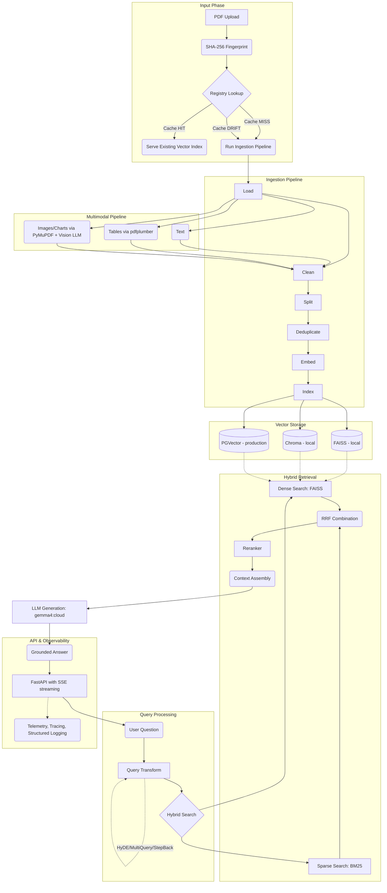

# DocMind Architecture Overview

## System Overview
DocMind is a 10-phase progressive RAG (Retrieval-Augmented Generation) engine built on LangChain, FastAPI, and local LLMs (Ollama `gemma4:cloud`). It is designed for robust document Q&A, featuring extensive support for multimodal ingestion including text, tables, images, and charts.

## Architecture Diagram



## 10-Phase Progression Table

| Phase | Module | Key Concepts |
|---|---|---|
| Phase 1 | [`llm/`](file:///c:/FS/langchain_document_qa/llm), [`chains/`](file:///c:/FS/langchain_document_qa/chains) | LLM Abstraction |
| Phase 2 | [`ingestion/`](file:///c:/FS/langchain_document_qa/ingestion) | Document Ingestion |
| Phase 3 | [`vectorstore/`](file:///c:/FS/langchain_document_qa/vectorstore) | Vector Stores |
| Phase 4 | [`memory/`](file:///c:/FS/langchain_document_qa/memory) | Conversational Memory |
| Phase 5 | [`tools/`](file:///c:/FS/langchain_document_qa/tools), [`agent/`](file:///c:/FS/langchain_document_qa/agent) | Tools & Agents |
| Phase 6 | [`api/`](file:///c:/FS/langchain_document_qa/api) | FastAPI Backend |
| Phase 7 | [`rag_advanced/`](file:///c:/FS/langchain_document_qa/rag_advanced) | Advanced RAG |
| Phase 8 | [`evaluation/`](file:///c:/FS/langchain_document_qa/evaluation) | Evaluation |
| Phase 9 | [`observability/`](file:///c:/FS/langchain_document_qa/observability) | Observability |
| Phase 10 | [`production/`](file:///c:/FS/langchain_document_qa/production), [`ingestion/`](file:///c:/FS/langchain_document_qa/ingestion) | Production Hardening |

## Key Design Decisions

1. **Dedicated embedding models (`nomic-embed-text`) separate from reasoning LLM (`gemma4:cloud`)**
   - **WHY**: Chat models produce non-normalized representations that are unsuitable for cosine similarity. Specialized embedding models yield better dense search results.
2. **Hybrid retrieval (Dense + BM25 + RRF)**
   - **WHY**: Pure dense search often fails on exact keywords, acronyms, and technical identifiers. BM25 catches exact matches, and Reciprocal Rank Fusion (RRF) ensures the best of both worlds.
3. **Content-based document identity (SHA-256) instead of filename**
   - **WHY**: Users often upload the exact same file under different names. Content hashing deduplicates logically identical files.
4. **Build-New-Then-Swap vector replacement**
   - **WHY**: A delete-before-embed approach can leave documents with zero vectors if the ingestion process fails midway. Swap ensures high availability.
5. **Configuration fingerprinting**
   - **WHY**: Changing `chunk_size` or the `embedding_model` inherently alters the resulting vector spaces. These changes must systematically invalidate cached vectors to prevent silent accuracy drops.

## Important Design Rule

> [!IMPORTANT]
> **Never hardcode the answer or benchmark behavior to pass a test.**

- All ingestion, retrieval, caching, multimodal processing, and evaluation behavior must be generic and strictly driven by the actual uploaded document and configuration.
- If the PDF changes, the answer changes.
- If the chunking strategy changes, the system detects drift and re-indexes.
- If the same binary is uploaded under another filename, the system correctly reuses the existing internal representation.
- If embedding, vision, table, or parser configuration changes, the system invalidates the previous cache and rebuilds the representations.

## Directory Structure

```text
c:\FS\langchain_document_qa\
├── agent/              # LangChain ReAct / conversational agents
├── api/                # FastAPI application, SSE streaming routes
├── chains/             # Specialized LCEL chains
├── docs/               # Architecture and documentation (this file)
├── evaluation/         # RAG evaluation metrics (RAGAS / TruLens approaches)
├── ingestion/          # Document loading, cleaning, multimodal extraction, splitting
├── llm/                # LLM instance initialization and configuration
├── memory/             # Conversational memory strategies (Window, Summary, etc.)
├── observability/      # Tracing, structured logging, LangSmith integration
├── production/         # Production readiness (Auth, Rate Limiting, Cache logic)
├── rag_advanced/       # HyDE, Multi-Query, StepBack, Context Assembly, Reranking
├── tools/              # Tools for agent interactions
└── vectorstore/        # Abstractions around FAISS, Chroma, and PGVector
```
