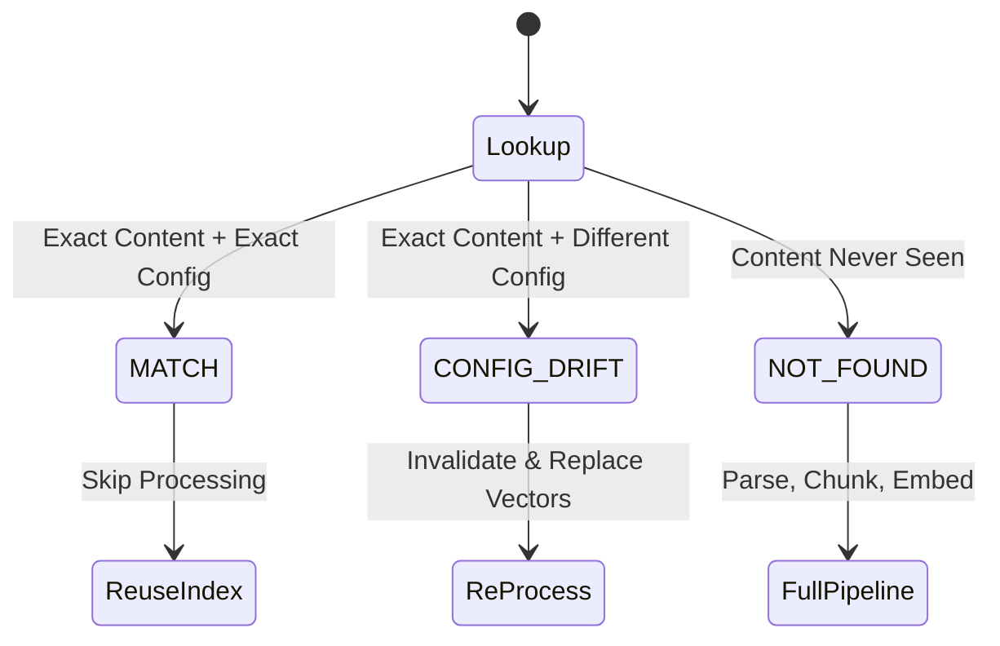
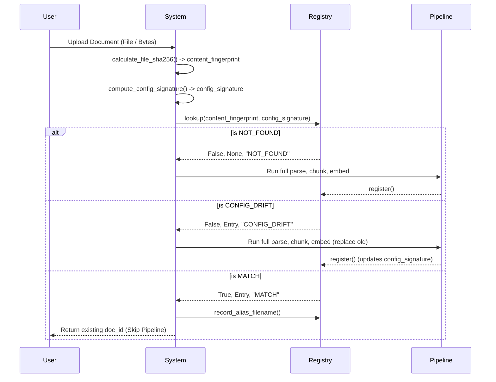

# Document Identity & Fingerprinting System

This document outlines the architecture and design decisions behind the document identity, cache, and configuration fingerprinting systems in the DocMind document QA engine.

## 1. Document Identity

The foundation of our ingestion pipeline is **binary content identity** rather than metadata-based identity. 

Document identity is established by a deterministic SHA-256 hash of the raw file bytes, implemented via [`calculate_file_sha256()`](file:///c:/FS/langchain_document_qa/ingestion/document_registry.py#L20-L32) in `ingestion/document_registry.py`.

### Implementation Details
- **Memory Efficiency**: The hashing function streams files in 64KB chunks (`65536` bytes). This prevents memory exhaustion when processing extremely large files, such as massive PDFs or localized database dumps.
- **Flexibility**: The function accepts both file paths and raw bytes, catering to various upload streams (e.g., local disk ingestion vs. in-memory HTTP streams).

### WHY Filename Cannot Be Used as Document Identity

We explicitly avoid using filenames as primary keys or identity tokens for the following reasons:

1. **User Behavior**: Users frequently download files from channels like Slack or Email, resulting in arbitrary or duplicate-suffixed names (e.g., `invoice_v2_final (1).pdf`).
2. **Portal Systems**: Third-party portal systems and internal temp-directories routinely generate temporary filenames (e.g., `tmp_849132.pdf`).
3. **Index Dilution**: If the same content is indexed under different filenames, it creates duplicate vector clusters. When a user asks a question, the Top-K vector retrieval will be filled with identical answers from "different" files, severely diluting the recall of *other* relevant contexts.

**Content Identity vs Filename Identity**: The filename is treated merely as *metadata* (an alias), whereas the content hash is the unalterable *identity*. Therefore, the same PDF uploaded with different filenames yields the exact same SHA-256 hash, identifying it as the exact same document.

### Caveat: Identical Text, Different Binaries

> [!WARNING]
> **Known Boundary Condition**
> Two PDFs with visually identical text can have entirely different binary representations. This can happen due to differences in PDF generators, metadata, embedded fonts, or compression artifacts. 
> 
> Because we hash the *binary representation*, SHA-256 will treat these as **different documents**. This is a known limitation of binary hashing, not a bug, and is accepted to avoid the immense computational overhead of performing full OCR/text-extraction just to establish identity.

## 2. Ingestion Cache (Document Registry)

To prevent redundant and expensive processing (PDF parsing, tokenization, chunking, vision API calls, and embedding generation), we use a persistent cache registry.

### Core Components

- [`DocumentRegistry`](file:///c:/FS/langchain_document_qa/ingestion/document_registry.py#L86) class manages the persistent, thread-safe cache.
- [`DocumentRegistryEntry`](file:///c:/FS/langchain_document_qa/ingestion/document_registry.py#L71-L83) is a Pydantic model representing a cached document. It tracks:
  - `content_fingerprint`: SHA-256 of the raw file bytes.
  - `config_signature`: SHA-256 of the ingestion configuration.
  - `doc_id`: Unique parent identifier in the vector store.
  - `filenames`: A list of known alias filenames for this exact content.
  - `file_type`, `file_size_bytes`, `chunks_count`, `character_count`, `config_details`.
  - `indexed_at` and `last_accessed_at`.

### Cache States & Resolution

The `lookup()` method checks for existing entries and returns a tuple: `(is_valid_cache, entry, reason)`. The `reason` can be one of three states:

### Persistence and Thread Safety

- **Persistence**: The registry is stored as a JSON file at `data/document_registry.json`. The `_save()` method safely ensures that parent directories are automatically created if they do not exist.
- **Graceful Degradation**: The `_load()` logic includes a `try/except` block. If the JSON file becomes corrupted or unreadable, the system degrades gracefully to an empty registry rather than crashing the ingestion pipeline.
- **Thread Safety**: All registry operations (`_load`, `_save`, `lookup`, `register`, `record_alias_filename`) are wrapped in a `threading.Lock()`, allowing safe concurrent ingestion across multiple worker threads.
- **Alias Filenames**: When an already-indexed document is uploaded with a new filename, `record_alias_filename()` appends the new filename to the entry's `filenames` list (deduplicating if necessary) and updates the `last_accessed_at` timestamp.

### Lifecycle

## 3. Configuration Fingerprinting

A document's representation in the vector database isn't just a function of its content—it is deeply tied to *how* it was processed. 

We generate a deterministic hash of the pipeline parameters via [`compute_config_signature()`](file:///c:/FS/langchain_document_qa/ingestion/document_registry.py#L35-L68). 

### Parameter Impact

Every parameter included in the signature directly affects the resulting indexed representation.

| Parameter | Type | Default | Why It Affects the Index |
| :--- | :--- | :--- | :--- |
| `chunk_size` | `int` | *required* | Changes chunk boundaries, determining exactly which text fragments end up in each vector. |
| `chunk_overlap` | `int` | *required* | Changes the overlap between chunks, affecting the context available at chunk boundaries. |
| `splitter_type` | `str` | `"recursive"` | Different splitters (recursive vs. token vs. markdown) produce radically different chunk sizes and boundaries. |
| `parser_type` | `str` | `"standard"` | Standard vs. multimodal parsers extract different base content elements from the same file. |
| `embedding_model` | `str` | `"nomic-embed-text"` | Different models produce vectors of different dimensions (e.g., 768 vs. 1536). **Mixing models causes dimension mismatch crashes** during retrieval. |
| `enable_vision_processing`| `bool`| `False` | When enabled, images and charts produce entirely additional chunks via the Vision LLM. |
| `vision_model` | `Optional[str]` | `None` | Different vision models generate different descriptions for the identical image. |
| `ocr_enabled` | `bool` | `False` | OCR'd text frequently differs from native embedded text extraction. |
| `table_strategy` | `str` | `"markdown"` | Different serialization formats for tables drastically alter the token composition of table chunks. |
| `prompt_version` | `str` | `"1.0"` | Vision LLM prompt changes dictate the nature of the generated multimodal descriptions. |
| `extra_options` | `Optional[Dict]`| `None` | An extensibility point that allows future pipeline parameters to trigger config drift. |

### Normalization & Determinism

To ensure the signature is deterministic across different environments and executions, the configuration is normalized before hashing:
1. All string values are **lowercased**.
2. The dictionary is serialized to a string via `json.dumps` with **`sort_keys=True`** to guarantee deterministic dictionary key ordering.
3. The resulting JSON string is encoded to UTF-8 and hashed via SHA-256.

### Behavior on Parameter Changes

When pipeline parameters change, the system automatically detects the drift and invalidates the cache:

- **`chunk_size` changes from 500 to 1000**: The configuration signature changes. The registry returns `CONFIG_DRIFT`. The document is re-chunked and re-embedded, replacing the old vectors to reflect the larger context windows.
- **`embedding_model` changes from `nomic` to `text-embedding-3-large`**: The signature changes. This triggers `DRIFT` and forces re-embedding. This is critical because dimensions change from 768 to 1536, and querying a 768-dim index with a 1536-dim vector would result in a hard crash.
- **`enable_vision_processing` toggles from `False` to `True`**: The signature changes. The system flags a `DRIFT` and re-processes the file using the vision pipeline, successfully creating the newly requested image/chart chunks.
