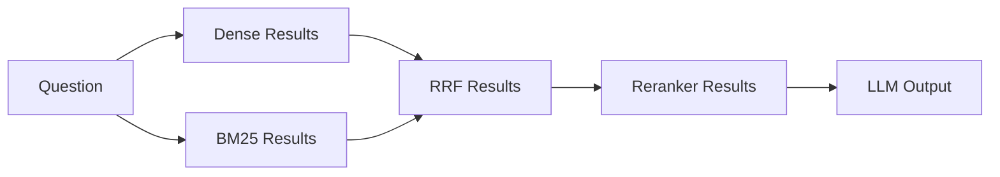

# Hybrid Retrieval System

This document outlines the architecture, strategies, and implementation details of the hybrid retrieval system in the DocMind project. The advanced retrieval engine combines semantic dense vectors with sparse lexical search and layers post-retrieval optimizations like reranking and contextual compression.

## 1. Dense Retrieval

The dense retrieval component leverages vector embeddings to perform semantic searches. 

- **Embeddings:** Vector embeddings are generated via `nomic-embed-text` (768 dimensions) running locally through Ollama.
- **Index:** FAISS or Chroma is used as the underlying dense index.
- **Distance Metric:** Cosine similarity or L2 distance is used to find nearest neighbors.
- **Good for:** Semantic meaning, paraphrasing, and conceptual similarity where exact keywords might not match.
- **Bad for:** Exact keywords, acronyms, technical identifiers, model numbers, or IDs (e.g., "Transformer (big)").

> [!NOTE]
> Dense vectors often suffer from "keyword blind spots." When users search for a highly specific technical identifier, the semantic representation might smooth over those exact characters, favoring conceptually similar but factually incorrect passages.

## 2. BM25 Sparse Retrieval

To overcome the limitations of dense retrieval, we employ a lexical sparse retrieval strategy using BM25.

- **Implementation:** [`BM25Index`](file:///c:/FS/langchain_document_qa/rag_advanced/sparse.py#L37-L57) and [`create_bm25_retriever`](file:///c:/FS/langchain_document_qa/rag_advanced/sparse.py#L20-L34) in [`rag_advanced/sparse.py`](file:///c:/FS/langchain_document_qa/rag_advanced/sparse.py).
- **Mechanism:** Term Frequency / Inverse Document Frequency (TF-IDF) based keyword matching.
- **Tokenizer:** The default tokenizer extracts lowercase word and number tokens: `re.findall(r"\w+", text.lower())`.
- **Retrieval Depth:** Default `k=4`.
- **Guards:** To prevent index creation errors, the system automatically creates a placeholder document (`empty`) when document lists are empty.
- **Good for:** Exact terms, model names ("Transformer (big)"), section numbers, and acronyms.
- **Bad for:** Paraphrasing, synonyms, and conceptual similarity.

## 3. Reciprocal Rank Fusion (RRF)

We fuse the results from Dense and Sparse retrieval using Reciprocal Rank Fusion (RRF).

- **Implementation:** [`reciprocal_rank_fusion()`](file:///c:/FS/langchain_document_qa/rag_advanced/hybrid.py#L17-L47) in [`rag_advanced/hybrid.py`](file:///c:/FS/langchain_document_qa/rag_advanced/hybrid.py).
- **Formula:** $RRF\_Score(d) = \sum \frac{1}{k_{rrf} + rank(d)}$
- **Parameters:** $k_{rrf}=60$ (dampening constant), `top_n=4` (output documents).
- **Deduplication:** Fused documents are deduplicated via a content hash.

**Why RRF instead of raw score combination?**
1. Dense search produces bounded cosine similarities in [0, 1].
2. BM25 produces unbounded scores in [0, ∞).
3. Direct score addition allows high BM25 scores to dominate the final ranking.
4. RRF operates purely on ordinal ranks, not raw scores, providing a fair representation and normalizing the inputs across disparate retrieval algorithms.

## 4. HybridRetriever

The [`HybridRetriever`](file:///c:/FS/langchain_document_qa/rag_advanced/hybrid.py#L50-L95) class orchestrates the dual-search approach.

- **Execution:** The `invoke()` method runs both the dense and sparse retrievers sequentially.
- **Fusion:** After parallel retrieval, the results are fused via RRF.
- **Transparency:** The `retrieve_with_details()` method returns an inspection dictionary containing `dense_count`, `sparse_count`, and `fused_count`, along with the raw document lists. This is critical for telemetry and debugging.

## 5. Query Transformations

To improve recall before retrieval even begins, we apply query transformations from [`rag_advanced/query_transform.py`](file:///c:/FS/langchain_document_qa/rag_advanced/query_transform.py).

1. **HyDE (Hypothetical Document Embeddings):** Generates a fake, hypothetical answer passage using an LLM, embeds that passage, and searches in "answer-space" rather than "question-space".
2. **Multi-Query:** Generates 3 alternative query formulations + the original query = 4 distinct queries. Retrieves results for all 4 queries and deduplicates them to overcome terminology mismatches.
3. **Step-Back:** Generates a higher-level, broader conceptual query. Retrieves both the specific documents and the foundational background context, allowing the LLM to understand the underlying principles before answering.

## 6. Reranking

Reranking applies a heavy, high-precision model to re-sort the initial candidate pool.

- **Implementation:** [`LLMReranker`](file:///c:/FS/langchain_document_qa/rag_advanced/reranker.py#L19-L86) in [`rag_advanced/reranker.py`](file:///c:/FS/langchain_document_qa/rag_advanced/reranker.py).
- **Scoring:** Uses an LLM-as-a-judge to assign a relevance score (0-10) based on how well the document answers the query.
- **Optimization:** Only parses the first 1000 characters of each document to save tokens and latency.
- **Depth:** Default `top_n=3`.
- **Parsing:** Uses regex extraction to pull the integer score, with a fallback score of 5.0 for malformed outputs.

## 7. Contextual Compression

To maximize the signal-to-noise ratio within the prompt context window, we employ a compression step.

- **Implementation:** [`ContextualCompressor`](file:///c:/FS/langchain_document_qa/rag_advanced/compression.py#L18-L67) in [`rag_advanced/compression.py`](file:///c:/FS/langchain_document_qa/rag_advanced/compression.py).
- **Mechanism:** Extracts only the specific sentences or data points relevant to the query from each chunk.
- **Fallback:** If the LLM determines a chunk has no relevant content, it is dropped. If all chunks are dropped, the system falls back to the original full documents to prevent empty context errors.

## 8. Pipeline Strategies

The orchestrator in [`rag_advanced/pipeline.py`](file:///c:/FS/langchain_document_qa/rag_advanced/pipeline.py) defines 8 execution flows for comparative analysis:

| Strategy | Execution Flow | Default Depth |
|----------|----------------|---------------|
| `baseline` | Standard dense vector search | k depends on vector store |
| `hyde` | Generate fake answer → Embed → Dense search | k depends on vector store |
| `multi_query` | Generate 3 variants + Original → Dense search all 4 → Deduplicate | k depends on vector store |
| `step_back` | Generate conceptual query → Dense search specific + background | k depends on vector store |
| `hybrid_rrf` | Dense search + BM25 sparse search (k=8) → RRF | Output top_n=8 |
| `reranked` | Hybrid search → LLM Scoring (0-10) → Take top 3 | Output top_n=3 |
| `compressed` | Hybrid search → Extract relevant sentences | Output top_n varies |
| `full_advanced` | Multi-Query → Hybrid RRF (top 6) → Reranked (top 3) → Compressed | Output top_n=3 |

## 9. Retrieval Depth and Why Increasing 'k' Matters

Retrieval depth (`k`) determines how many chunks are pulled from the index. While BM25 defaults to `k=4`, the advanced pipeline strategies use `k=8`.

> [!TIP]
> Increasing `k` is especially crucial for multimodal datasets. Tables, charts, and diagrams often compete with raw text chunks for the top-k slots. A low `k` might prune relevant tabular data before the reranker or LLM ever sees it. Increasing `k` recovers this context.

## 10. The Reranker Latency-Precision Trade-off

Based on internal ablation studies, adding an LLM reranker introduces a significant latency-precision trade-off.

- **Accuracy Improvement:** 93.3% → 95.0%
- **Latency Increase:** +350% (2019ms → 7187ms)

> [!IMPORTANT]
> **Production Recommendation:** Do not use the reranker for all queries. Selectively route complex, multi-hop, or reasoning queries to the reranker, while simple factual queries should use direct RRF.

## 11. Q23/Q24 Diagnostic Case Study

During the 30-question Transformer benchmark evaluation, we encountered two notable failures that highlight proper diagnostic methodology.

**Q24 Issue (Missing Table Data):**
Q24 initially failed because the retrieval depth was insufficient to capture table data, which had been relegated to lower-ranked chunks by the dense retriever. Increasing the retrieval depth (`k`) successfully recovered the relevant context.

**Q23 Issue (Information Boundary):**
Q23 failed, but upon investigation, it was an information-boundary problem—the answer simply did not exist in the source paper. 

**Diagnostic Methodology:**
When debugging advanced RAG systems, do not just look at the final LLM output. Trace the data layer-by-layer:

By inspecting the pipeline at each boundary, you can accurately determine WHERE the failure occurs (e.g., "The relevant chunk was retrieved by BM25 but pruned by the reranker").
