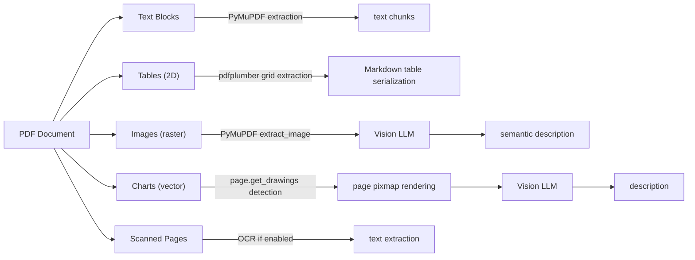

# Multimodal RAG Pipeline

This document outlines the architecture and engineering rationale behind DocMind's unified multimodal RAG pipeline. It details how the system processes text, structured tables, raster images, and vector charts into a unified retrieval index.

## 1. The Problem: Text-Only RAG Failures

Standard text-only extraction frequently fails on modern documents (like slide decks and financial reports) due to two major architectural barriers:

1. **Table Flattening Problem**: Standard PDF text extractors destroy 2D table structures. A 2D grid is read left-to-right, concatenating cells into unstructured, unaligned text (e.g., `"Deliveries Model 3/Y 1,704,093 Other 85,133"`). This destroys relationships between column headers and row values, causing retrieval to fail on structured queries.
2. **Vector Chart Blindness**: Pure image extractors (like `page.get_images()`) search for embedded bitmap objects. However, many charts and graphs in modern PDFs are drawn using vector paths (lines and curves). Because they are not raster images, standard extractors are completely blind to them, silently omitting critical data.

## 2. Complete Multimodal Pipeline

The architecture is designed to identify the exact nature of an element and route it to the appropriate extraction and interpretation sub-system:

## 3. Text Extraction

- **Engine**: PyMuPDF (`fitz`) handles high-speed extraction of text blocks.
- **Metadata**: Each chunk carries page-level metadata including `page_number` and source `filename`.
- **Chunking**: Text is split using LangChain's `RecursiveCharacterTextSplitter`. In the multimodal pipeline, the parameters are optimized to `chunk_size=600` and `chunk_overlap=80` to maintain tight semantic context around facts.

## 4. Table Extraction

- **Engine**: `pdfplumber` is utilized for its high-accuracy, coordinate-bounded table grid detection.
- **Serialization**: Tables are serialized into Markdown format (`| Column | Column |`). This preserves column headers and row borders, making the relationships readable for both dense vector embeddings and BM25 exact keyword matching.
- **Chunking**: Each table is maintained as a single atomic `Document` and is **not** split by the text splitter. Splitting a table would sever the relationship between a row and its header.
- **Metadata**: Table chunks receive `element_type="table"`, `table_rows`, `table_cols`, and a precise `content_hash`.

## 5. Image and Chart Extraction

- **Raster Images**: Embedded bitmap images are extracted directly using PyMuPDF's `page.get_images(full=True)`.
- **Vector Charts**: The system detects pages containing substantial vector graphics (triggering if `len(page.get_drawings()) >= 8`). For these pages, it renders a high-resolution 150 DPI page pixmap so that non-bitmap charts can be visually analyzed.
- **Why Image EXTRACTION is not Image UNDERSTANDING**:
  - PyMuPDF merely extracts the **raw pixel data**.
  - A Vision LLM (`gemma4:cloud` via Ollama) is required to understand what the image contains semantically.
  - The Vision LLM generates a factual textual description of the visual element using a strict anti-hallucination prompt.
  - This **text description** becomes the searchable chunk in the vector store, not the raw image pixels.

## 6. Vision LLM Integration

- **Subsystem**: Implemented via `VisionModelProvider` in `llm/vision.py`.
- **Process**: The `describe_image(image_path, context_hint)` function sends the extracted image bytes to the vision model (`gemma4:cloud`).
- **Anti-Hallucination Prompt**: The system prompt forces the LLM to extract specific, factual components:
  - Visual Type (e.g., Bar Chart, Diagram)
  - Title / Caption
  - Axes & Units
  - Key Data Points (exact numbers)
  - Trends & Relationships
- **Graceful Degradation**: If vision processing is disabled or fails, placeholder descriptive text (e.g., `[Visual element present...]`) is used to ensure the pipeline continues smoothly.

## 7. Multimodal Chunks and Metadata

The disparate elements are merged into a stream of unified LangChain `Document` objects:
- **Element Tagging**: Each chunk uses `element_type` metadata to identify itself as `"text"`, `"table"`, `"image"`, or `"chart"`.
- **Universal Metadata**: Every chunk universally carries `page_number`, source file, and `content_hash`.
- **Visual Metadata**: Image and chart chunks specifically include an `image_path` (to the locally saved render) and the `visual_description` generated by the LLM.

## 8. Retrieval and Citations

- **Element-Aware Citations**: Because elements retain their origin metadata, the system generates specific, element-aware citations in the final answer:
  - `[Source: file.pdf, Page 5, Type: table]`
  - `[Source: file.pdf, Page 14, Type: chart]`
- **Context Formatting**: The context provided to the reasoning LLM includes the element type, helping it understand the structural source of the information.
- **Hybrid Retrieval**: The Hybrid Dense + BM25 retrieval seamlessly handles all element types since they have all been serialized into robust text representations.

## 9. The Important Distinction

To understand the architecture, it is critical to distinguish the roles of each subsystem:
- **PyMuPDF** EXTRACTS images (it handles raw pixels and file parsing).
- **Vision LLM** UNDERSTANDS images (it extracts semantic content and meaning).
- **LangChain** ORCHESTRATES the pipeline (routing documents, chunking, and managing metadata).
- **FAISS/PGVector** STORES and RETRIEVES the text representations.
- **FAISS is NOT multimodal** — the vector database strictly stores the rich *text descriptions* of the visual elements (along with metadata pointers), not the binary images themselves.

## 10. Benchmark Results (Tesla Shareholder Report)

Testing against a real 36-page investor deck revealed a massive improvement when shifting from Text-Only to Multimodal RAG:

| Test # | Difficulty Level | Test Question | Text-Only Baseline | **Multimodal RAG** | **Source Element** |
| :---: | :--- | :--- | :---: | :---: | :---: |
| **1** | **Level 1: Text** | What was Tesla's total revenue in 2024? | PASS ($97,690M) | **PASS ($97,690M)** | `[Page 5, Type: table]` |
| **2** | **Level 2: Table** | How many total vehicles did Tesla deliver in 2024 by model? | ❌ FAIL (Flattened/Lost) | **PASS (1,789,226 total; Model 3/Y: 1,704,093...)** | `[Page 8, Type: table]` |
| **3** | **Level 3: Visual Chart** | What does the vehicle deliveries and production chart show? | ❌ FAIL (Blind to Charts) | **PASS (4Q peak 0.50M; +2% deliveries vs -7% production)** | `[Pages 7, 26, Type: chart]` |
| **4** | **Level 3: Visual Chart** | What does the Average COGS per vehicle chart show? | ❌ FAIL (Blind to COGS) | **PASS (Q1 $36.8k, Q2 $36.9k, Q3 $35.2k, Q4 $34.8k)** | `[Page 14, Type: chart]` |
| **AVG** | **Overall Performance** | **Real Multi-Page Deck** | **25% Success** | **🚀 100% Success (4/4 PASS)** | |
