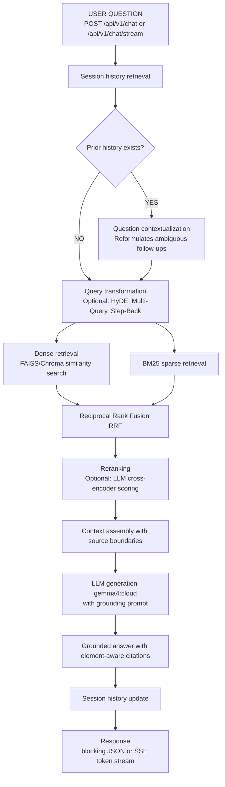

# Query Lifecycle

This document describes the RAG query execution lifecycle in DocMind.

## Workflow Overview

## Immediate Querying

Documents are indexed into the vector store in real-time during the upload lifecycle. Because the document metadata (like `content_fingerprint` and configuration signature) is registered immediately, cached documents can be queried instantly without requiring re-ingestion or restarting the app.

## Blocking vs. Streaming Endpoints

- **Blocking (`/api/v1/chat`)**: Waits for the entire RAG pipeline to finish and returns a single JSON payload containing the `answer` and `citations`.
- **Streaming (`/api/v1/chat/stream`)**: Uses Server-Sent Events (SSE) to stream the response, which significantly reduces perceived latency. 

### SSE Streaming Protocol
The streaming endpoint yields three distinct event types:
1. `citations` event: Dispatched immediately after retrieval, providing the sources before generation starts.
2. `token` events: Streamed chunks of the LLM's generated response as they arrive.
3. `done` event: Indicates the stream has concluded.

## Agent Routing and Tool-Calling

The core Advanced RAG pipeline uses a unified strategy pattern supporting baseline, HyDE, multi-query, step-back, hybrid RRF, reranked, and contextual compression. An agent route utilizes a tool-calling loop where it can iteratively formulate sub-queries, execute the pipeline to gather contexts, and evaluate if sufficient information exists before finalizing the grounded answer.

## Retrieval Depth and Quality

The retrieval depth (`k` parameter) directly influences answer quality. Dense and sparse retrievers pull a broader set of candidates (e.g., `k=8`), which are then fused via Reciprocal Rank Fusion (RRF) and optionally reranked (e.g., narrowed to `top_n=3`). A higher `k` increases recall but requires reranking or contextual compression to maintain precision and stay within the LLM context limits.

## Element-Aware Citations

The RAG pipeline preserves document structure. When context is assembled, it explicitly incorporates the element type (e.g., text, table, chart). The generator prompt forces the LLM to provide element-aware citations (e.g., `[Source: file.pdf, Page 4, Type: Table]`), enabling users to trace exactly which structural component answered their query.
