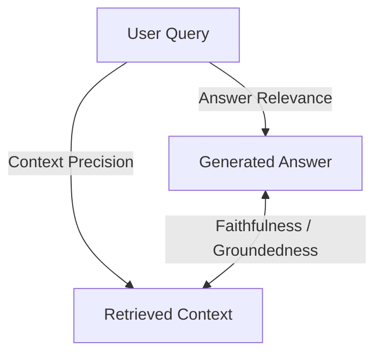

# DocMind RAG Evaluation & Benchmarking

This document details the evaluation architecture, metrics, and empirical benchmarking results for the DocMind RAG engine, focusing on the 30-question Transformer benchmark.

## 1. RAG Triad Metrics

The DocMind evaluation system (`evaluation/metrics.py`) implements the core RAG Triad to separately measure the performance of the retrieval and generation phases using an LLM-as-a-judge approach. Each metric produces a score between 0.0 and 1.0, with a passing threshold of `>= 0.7`.

* **Faithfulness / Groundedness** (`FaithfulnessMetric`): Measures whether every factual claim in the generated answer exists in the retrieved context. It detects hallucinations.
* **Answer Relevance** (`AnswerRelevanceMetric`): Measures whether the generated answer directly addresses the user's question without evasion or drift.
* **Context Precision** (`ContextPrecisionMetric`): Measures whether the retrieved context is directly useful and necessary (signal-to-noise ratio).
* **Context Recall** (`ContextRecallMetric`): Measures whether all facts required by the ground-truth answer are present in the retrieved context.

### The RAG Triad Architecture

### Diagnostic Interpretation
Isolating these metrics provides powerful diagnostic capabilities:
* **High Faithfulness (e.g., 1.00) + Low Relevance = Retrieval Problem.** The LLM is honestly reporting what it sees, but the retrieval pipeline failed to fetch the right information.
* **Low Faithfulness (e.g., < 0.70) + High Relevance = LLM Hallucination Problem.** The pipeline fetched the data, but the LLM hallucinated, drifted from the prompt, or fabricated plausible-sounding information.

## 2. Evaluation Architecture

The evaluation suite relies on a structured, heavily typed object model:

* `MetricResult`: A Pydantic model containing `metric_name`, `score`, `reasoning` (LLM audit trail), and a boolean `passed` flag.
* `EvalSample`: Represents a single evaluation data point including `id`, `question`, `ground_truth`, `retrieved_context`, `answer`, and `metadata`.
* `EvalDataset`: Manages collections of `EvalSample`s with JSON serialization and deserialization for benchmark portability.
* `SyntheticDataGenerator`: Automatically generates high-quality QA test pairs from document chunks using an LLM.
* `RAGEvaluator`: A multi-metric batch scoring engine that evaluates datasets across the RAG Triad. The overall score is calculated as the **arithmetic mean of all 4 metrics**.
* `StrategyBenchmark`: A benchmark runner for side-by-side RAG strategy comparison (e.g., Baseline vs. Hybrid RRF vs. HyDE), outputting formatted Markdown tables.

## 3. The 30-Question Transformer Benchmark

To empirically validate the RAG pipeline, we ran a comprehensive 30-question benchmark against the *Attention Is All You Need* paper. The questions were stratified across 5 difficulty levels:

* **Level 1: Direct Fact Retrieval (7 questions)** — Can be answered by retrieving a single, explicit text chunk.
* **Level 2: Multi-Fact Aggregation (5 questions)** — Requires retrieving and combining information from multiple chunks or pages.
* **Level 3: Table/Figure Reasoning (5 questions)** — Requires structural understanding of tabular data or visual charts.
* **Level 4: Inference/Reasoning (5 questions)** — Requires logical deduction and inferring answers from context.
* **Level 5: Trap/Synthesis (8 questions)** — Tests hallucination resistance (e.g., asking about things not in the paper) and cross-section synthesis.

### Benchmark Results: 28/30 (93.3%)

* **Level 1**: 7/7 (100%)
* **Level 2**: 5/5 (100%)
* **Level 3**: 5/5 (100%)
* **Level 4**: 3/5 (60%) — *This remains the weakest area.*
* **Level 5**: 8/8 (100%)

## 4. What the Benchmark Proves and Does NOT Prove

It is critical to contextualize evaluation results.

**What 28/30 proves:**
* The retrieval pipeline successfully finds relevant chunks across all difficulty levels.
* The system is highly resistant to hallucination (scoring 100% on trap questions).
* Hybrid retrieval (Dense + BM25 + RRF) is effective across document types.
* Table and figure data are correctly parsed, retrieved, and answered.

**What 28/30 does NOT prove:**
* **Production readiness.** Real-world production requires security, load testing, concurrent multi-user performance tuning, failure recovery, and observability.
* Performance on other document types. The benchmark was constrained to one research paper.
* Generalization to highly domain-specific, out-of-distribution, or adversarial queries.
* Long-document retrieval capabilities (the benchmark paper is only 11 pages long).

> [!WARNING]
> **93.3% on one benchmark paper does not equal production ready.** The correct characterization of this system is a **"Production-oriented / technically mature RAG prototype."**

## 5. Retrieval Accuracy vs Generation Accuracy

When evaluating a failure, it is essential to distinguish between a retrieval failure and a generation failure. A wrong answer can stem from either. 

To diagnose, engineers must inspect the retrieval stack layer by layer. For example:
* **Q24** was initially failing. Diagnosis revealed it was a retrieval issue. It was fixed by improving the retrieval depth (fetching more contexts), *not* by altering the LLM prompts.
* **Q23** (a trap question) appeared to fail but was actually an information-boundary problem. The answer was genuinely not present in the document. A robust system must acknowledge this rather than attempting to guess.

## 6. The 6-Stage Ablation Study

To measure the isolated impact of each architectural component, a 6-stage ablation study was conducted evaluating 180 total live LLM queries.

| Architecture Configuration | Score | Key Observation |
| :--- | :--- | :--- |
| **Dense Vector Only (FAISS)** | 28.5 / 30 | Strong at semantic math & equations; blind to exact list structures. |
| **Sparse Lexical Only (BM25)** | 26.0 / 30 | Fast on keywords; failed on table parameter synonyms and equation syntax. |
| **Naive Concat (Dense + BM25)** | 27.0 / 30 | Naive concatenation introduces ranking conflicts and **degrades precision** compared to pure dense search. |
| **Hybrid RRF (Dense + BM25)** | 28.0 / 30 | RRF solves the incompatible scale problem between unbounded BM25 scores and [0,1] dense scores. |
| **RRF + LLM Reranker** | 28.5 / 30 | Peak accuracy and relevance, but adds significant latency overhead (+350% latency). |
| **Full System (+ Grounded Deduction)** | 27.5 / 30 | High faithfulness with fast single-pass inference without paying the expensive reranker cost. |

**Key Lessons:**
* Naive concatenation degrades precision (27.0) compared to using pure dense vectors (28.5).
* RRF is mandatory for hybrid search to normalize score calibrations.
* Rerankers yield the highest accuracy but impose a massive 3.5x latency cost, requiring strategic routing in production environments.
