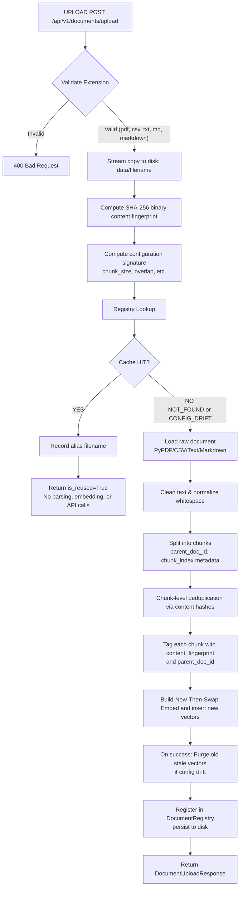

# Document Upload Lifecycle

This document describes the lifecycle of a document uploaded to the DocMind API.

## Workflow Overview

## File Types and Multimodal Pipeline

- **Text/Markdown/CSV**: Parsed sequentially, split into text chunks based on the configured `chunk_size` and `chunk_overlap`.
- **PDF**: Handled by a multimodal pipeline. It extracts text, but also identifies and processes tables, images, and charts differently, adding specific `element_type` metadata to the resulting chunks for precise downstream attribution.

## Deduplication and Caching

The ingestion pipeline uses a robust caching mechanism:
1. **Cache Hit**: If the exact same file (matching SHA-256 fingerprint) and configuration (matching config signature) is uploaded again, the system bypasses parsing and embedding. It returns an immediate response with `is_reused=True`.
2. **Chunk-Level Deduplication**: During new ingestion, chunks are hashed. This helps in deduplicating content within the system.
3. **Build-New-Then-Swap**: When a configuration drift occurs (e.g., chunk size changes), new vectors are built and inserted first. Upon success, the old stale vectors associated with the previous configuration are purged.

## HTTP Response Codes

- `201 Created`: Document successfully ingested and indexed (or successfully reused from cache).
- `400 Bad Request`: Unsupported file extension. Allowed are `.pdf`, `.csv`, `.txt`, `.md`, `.markdown`.
- `422 Unprocessable Entity`: The file was parsed but produced zero text chunks.
- `500 Internal Server Error`: Failed to write to disk or ingestion pipeline failed.
